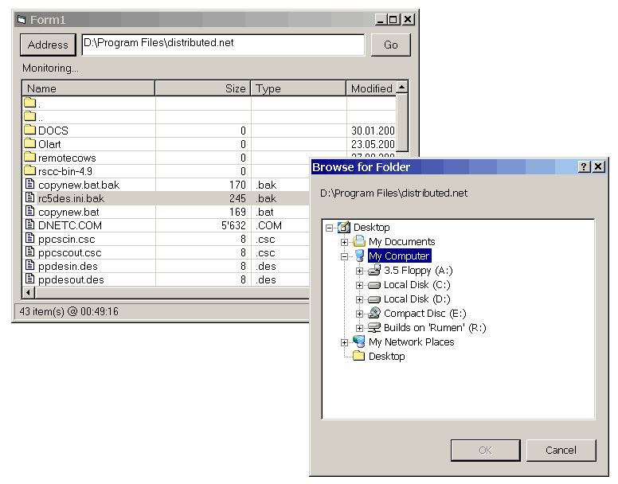



## Compact In\-Process Multi\-threading: A FolderWatcher with sample UI

### Description

Well, here you have it: multi-threaded component using FindFirstChangeNotification API, compactly implemented in 386 lines of code and a 285 lines of sample UI:-))) And most of these are VB codelines which are not overly commented, be warned, this is not for the faintest of heart! Greatly inspired by http://www.relisoft.com/Win32/watcher.html. Attempted an implementation after a short conversation with NovaSoft about Walter Brebels' Directory Monitor. It can successfully monitor for recursive changes in the sub-folders, too. Hope you find a useful use for this component. Please, read [1st readme.txt] first! Enjoy, and leave your votes!
 
### More Info
 

             |
---                |---
**Submitted On**   |2002-06-29 02:40:10
**By**             |[Vlad Vissoultchev](https://github.com/Planet-Source-Code/PSCIndex/blob/master/ByAuthor/vlad-vissoultchev.md)
**Level**          |Intermediate
**User Rating**    |4.8 (106 globes from 22 users)
**Compatibility**  |VB 6\.0
**Category**       |[Windows System Services](https://github.com/Planet-Source-Code/PSCIndex/blob/master/ByCategory/windows-system-services__1-35.md)
**World**          |[Visual Basic](https://github.com/Planet-Source-Code/PSCIndex/blob/master/ByWorld/visual-basic.md)
**Archive File**   |[Compact\_In999716282002\.zip](https://github.com/Planet-Source-Code/vlad-vissoultchev-compact-in-process-multi-threading-a-folderwatcher-with-sample-ui__1-36373/archive/master.zip)

